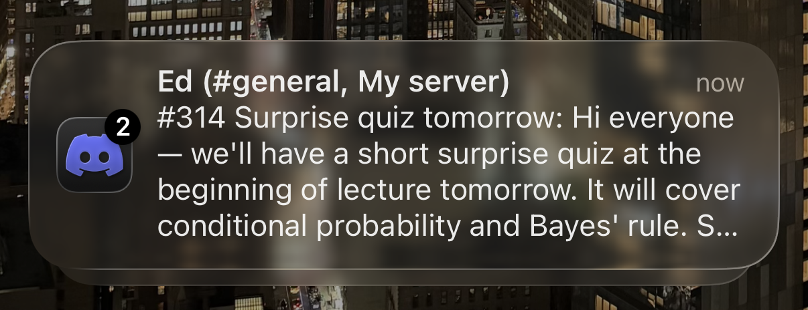
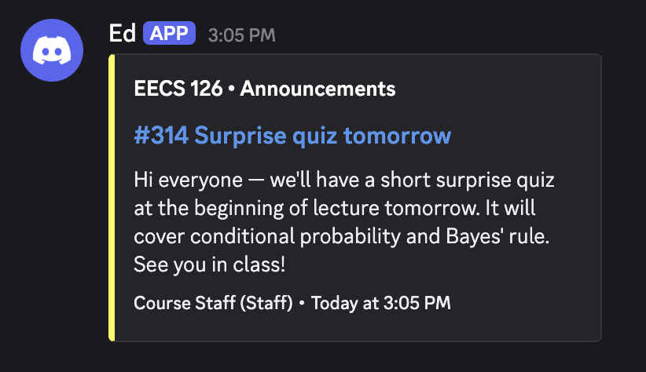

# EdToDiscord

I built EdToDiscord because I hated the notification experience in Ed. I would get a bunch of emails every day, but each email only showed the course title and no useful preview of the post. I still had to open Ed just to find out whether an announcement mattered.

EdToDiscord checks Ed every five minutes and sends useful announcements to Discord instead. The Discord message includes the course, category, author, post title, content preview, and a link to the original thread.

It runs as a Cloudflare Worker, so there is no server or Docker container to keep running.





## What gets posted

EdToDiscord sends:

- Public announcements
- Public posts and questions written by users with the `staff` or `admin` course role

It never sends private threads. Student posts are ignored unless the thread is an announcement.

The first run saves the newest thread in each selected course without posting anything. After that, new matching threads are sent in order. A SHA-256 cursor for each course is stored in Workers KV so the same posts are not sent every five minutes.

## Setup

1. Open your Discord channel settings, go to **Integrations → Webhooks**, create a webhook, and copy its URL.
2. Open [Ed API Token Settings](https://edstem.org/us/settings/api-tokens), create a token, and copy it.
3. Clone the repository and run the setup script:

   ```sh
   git clone https://github.com/neilthomass/ed-to-discord.git
   cd ed-to-discord
   ./setup.sh
   ```

The setup script asks for the Ed token and Discord webhook, loads your available courses, and shows a checkbox-style course list. It runs the tests, signs in to Cloudflare if needed, creates the KV namespace, and deploys the Worker.

After deployment, the Worker runs every five minutes. Its first run only initializes the cursors, so it does not post old threads.

## Acknowledgements

EdToDiscord was inspired by [bachtran02/ed-discohook](https://github.com/bachtran02/ed-discohook), redesigned to run on Cloudflare Workers without the overhead of operating your own server.
